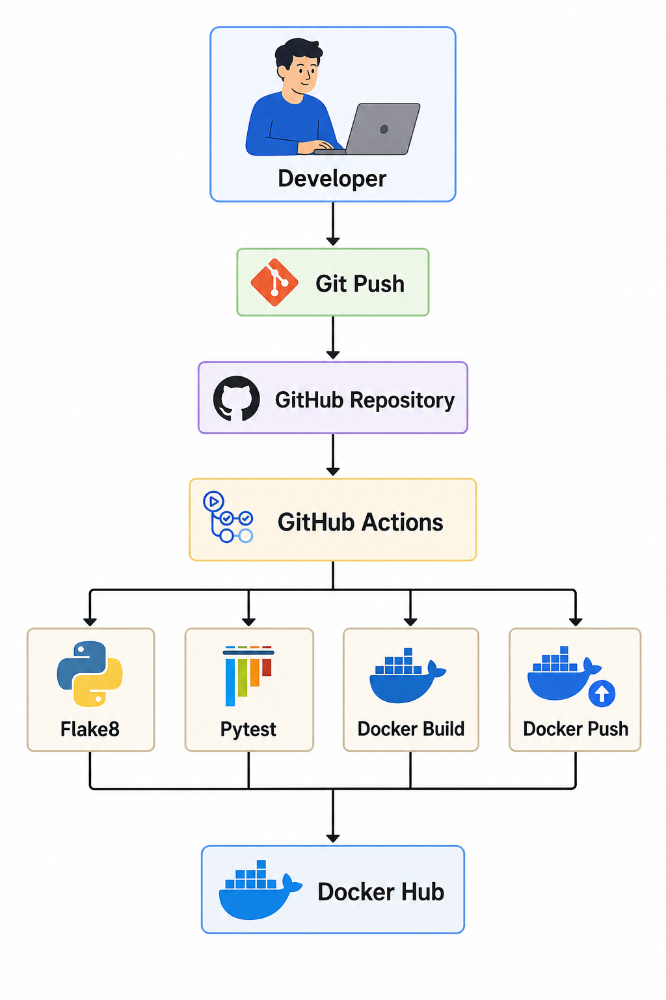
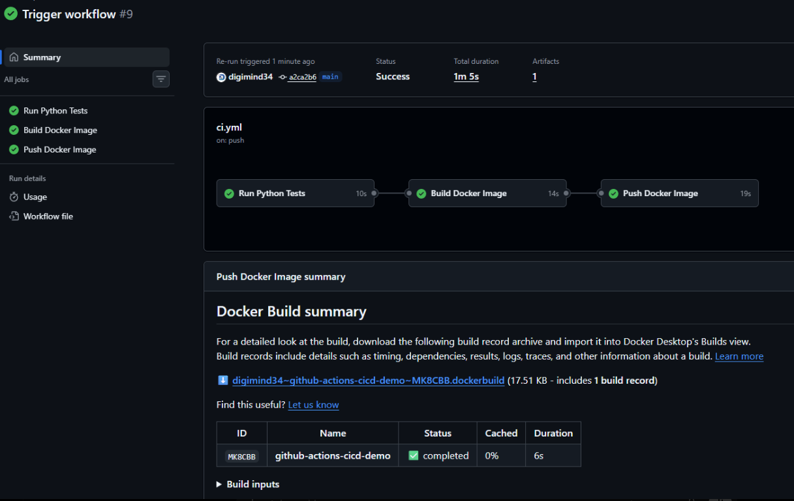

# GitHub Actions CI/CD Demo


## Overview

This project demonstrates a complete Continuous Integration and Continuous Deployment (CI/CD) pipeline using GitHub Actions, Python, Docker, and Docker Hub.

The pipeline automatically:

* Runs code quality checks with Flake8
* Executes automated tests using Pytest
* Builds a Docker image
* Authenticates with Docker Hub using GitHub Secrets
* Publishes the Docker image to Docker Hub

---

## Architecture

```text
Developer
    ↓
Git Push
    ↓
GitHub Repository
    ↓
GitHub Actions
 ├── Flake8 Linting
 ├── Pytest Testing
 ├── Docker Build
 └── Docker Push
    ↓
Docker Hub Repository

## Architecture


```

---

## Technologies Used

* GitHub Actions
* Python 3.12
* Pytest
* Flake8
* Docker
* Docker Hub

---

## Project Structure

```text
github-actions-cicd-demo
├── .github
│   └── workflows
│       └── ci.yml
├── app
│   ├── __init__.py
│   └── main.py
├── tests
│   ├── __init__.py
│   └── test_main.py
├── Dockerfile
├── requirements.txt
└── README.md
```

---

## CI/CD Pipeline Stages

### 1. Linting

```bash
flake8 .
```

Performs static code analysis and style validation.

### 2. Testing

```bash
pytest
```

Runs automated unit tests.

### 3. Docker Build

```bash
docker build -t github-actions-cicd-demo .

## Successful CI/CD Pipeline


```

Builds the application container image.

### 4. Docker Push

```bash
docker push digi2/github-actions-cicd-demo:latest
```

Publishes the image to Docker Hub.

---

## Docker Hub Repository

```text
digi2/github-actions-cicd-demo
```

Pull the image:

```bash
docker pull digi2/github-actions-cicd-demo:latest
```

Run the image:

```bash
docker run digi2/github-actions-cicd-demo:latest
```

---

## Skills Demonstrated

* Continuous Integration (CI)
* Continuous Deployment (CD)
* GitHub Actions Workflow Development
* Docker Containerization
* Docker Hub Image Publishing
* Secret Management
* Automated Testing
* Code Quality Automation

---

## Author

Babatunde Ayo

DevOps & Cloud Engineer

GitHub: https://github.com/digimind34
